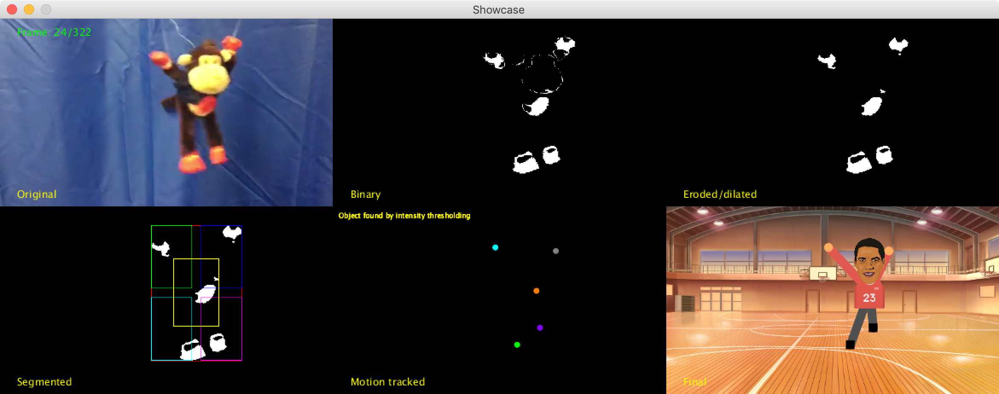

# 2D Motion Tracker

Tracks the motion of a monkey and replaces it with a dodgeball playing puppet of Denzel Washington to the tune of Rocky V's "Gotta Fly Now".

## Instructions

Each of the folders is part of the pipeline. The .tif images were removed (since they took up a lot of space) so the input/output frames need to be generated in order first by running the processing files (inside each folder) in order. You will need to copy across the output folder for each step.

1. ExtractFrames
input file: monkey.mov

output folder: extractedframes

2. BinaryImage
input folder: extractedframes

output folder: binaryframes

3. DilationErosion
input folder: binaryframes

output folder: binaryenhanced

4. DodgeballDenzel
input folder: binaryenhanced

output folder: motiontracked

The folders not listed may be run as well, but you'll need to check in their source code for what input they require. They are just intermediate steps.
